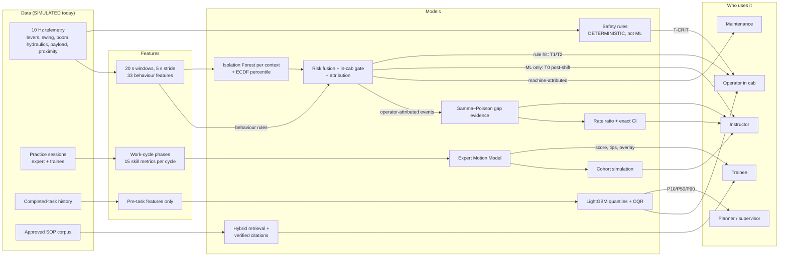

# CAT Sentinel: the machine learning, explained

Status on 2026-09-23. All data is **SIMULATED**. `models/` is empty today. Every trained model is built when `python -m ml.train_all` runs ("trains tomorrow"). Everything below was checked against the code, configs and tests.

## 1. Summary

CAT Sentinel uses ML for three jobs:

- **Unusual behaviour:** spot risky operating patterns that no rule anticipated.
- **Coaching:** score trainees against a statistical model of how safe experts move, and turn the gaps into ranked tips.
- **Task time:** estimate duration with a calibrated uncertainty range.

Statistics turns these outputs into decisions:

- Bayesian rates decide who needs training.
- Exact intervals show whether the training worked.

A retrieval copilot answers only from approved documents. The principle throughout is: **deterministic rules protect; ML explains, personalises and coaches; ML never controls the machine.**

- Critical protections are fixed rules in a separate process that ML cannot suppress.
- An ML anomaly on its own never produces an in-cab alert.
- No model can mark an operator competent.

## 2. ML map

Caterpillar requirements: **R1** task dashboard · **R2** operator safety · **R3** training hub · **R4** unusual behaviour · **R5** task-time estimation.

| Component | Problem solved | Req. | Technique | Inputs | Output | Why ML (vs rules) | Status today | How we evaluate |
|---|---|---|---|---|---|---|---|---|
| **(a) Expert Motion Model** (showcase) | Generic training feedback | R3, R2 | Phase classifier + HMM, envelopes + DTW, skill metrics, one-class scorer, safety cap, ranked tips | 10 Hz levers, joint angles, swing, pressure, payload, truck distance | 0–100 score, ≤ 5 tips, overlay, m³/h gap → $ | "Expert-like" is a multi-signal distribution, not one threshold | Built, fixture-tested; **trains tomorrow** | Leave-one-expert-out; archetype separation |
| **(b) Unusual behaviour** | Unanticipated risky patterns, without alarm fatigue | R4, R2 | Windowed features, Isolation Forest per context, ECDF percentile, alert budget, robust z, attribution, fusion | 10 Hz CAN-style signals (+ proximity) | Percentile, top-3 reasons, attribution, tier | Unknown patterns; "normal" depends on context | Built; rules-only until **trained tomorrow** | Injected anomalies; false alerts/h; robust-z baseline |
| **(c) Task time** | Point guesses, no uncertainty | R5, R1 | LightGBM quantiles + CQR, TreeSHAP drivers | Pre-task fields only | P10/P50/P90, remaining time, drivers | Interacting drivers; calibrated bands | Baseline runs today; model **trains tomorrow** | Coverage, pinball, MAE against baseline |
| **(d) Gap evidence** | Training by calendar; one bad shift must not label anyone | R3 | Bayesian Gamma–Poisson, P(rate > ref) ≥ 0.8 + recurrence floor | Operator-attributed events + exposure | Gap, posterior P, evidence | Small counts need uncertainty | Built, running | Rule tests; instructor agreement (pilot) |
| **(e) Reassessment** | Did training work? | R3 | Rate ratio, exact conditional binomial CI | Pre/post events + exposure | RR, 95 % CI, verdict + caveat | Honest at tiny counts | Built, running | Numerical tests; control arm (pilot) |
| **(f) RAG copilot** | Answers from SOPs, not invention | R3 | BM25 + TF-IDF with RRF, citation verification, extractive and refusal modes | Question + 7 approved SAMPLE SOPs | Cited answer, quote or refusal | Free-text questions | Built, running | Gold set: cited vs refused |
| **(g) Cohort simulation** | Coaching benefit before a pilot | R3 | Simulated learning curves, coached vs control | Metric references + sourced assumption | Sessions to proficiency, m³/h | No field data yet | Built, running | Sanity tests only. **Not evidence** |

### How each part works, in plain words

**(a) Expert Motion Model:**
1. **Segment.** A LightGBM classifier (boosted decision trees) labels each 0.1 s sample as dig, swing loaded, dump, swing empty or idle. An HMM, which knows phases follow a cycle, cleans up the sequence.
2. **Envelopes.** Each phase is stretched to 101 points of "normalised time", so fast and slow swings compare point by point. The expert band is P10/P50/P90 over 6 channels. DTW (time-warped curve distance) measures the distance to the expert median.
3. **Metrics.** 15 per cycle, including swing smoothness (log dimensionless jerk), lever reversals, boom–swing overlap, swing speed within 5 m of the truck, overshoot, idle gaps, bucket fill and time outside the envelope.
4. **Score.** A one-class Gaussian mixture learns only what experts look like. Likelihood is mapped to 0–100 through the expert ECDF (empirical distribution): expert median → 90, expert P10 → 78, well outside the band → 40.
5. **Safety gate.** Expert cycles over a site cap (> 35 °/s swing near the truck, > 15° overshoot) are **removed before training**. A flagged trainee cycle can't score above 60, and a session with a flagged cycle can't reach "expert-like".
6. **Tips.** Ranked by distance outside the band × a safety weight, so safety comes first. Each tip links to a competency and a module and never says "go faster".
7. **Productivity.** m³/h = 3600 / cycle time × payload / density, reported as the gap to the expert.

**(b) Unusual behaviour:**
- **Features.** 33 per window, 28 without proximity sensors.
- **Detector.** An Isolation Forest isolates rare windows in few random splits. It is trained per machine type × task when there are ≥ 2,000 windows, ≥ 3 operators and ≥ 2 machines, with a machine-type fallback otherwise.
- **Calibration.** Scores become a context percentile against a later calibration split.
- **Thresholds.** Set by an **alert budget**: the lowest τ whose bootstrap upper 95 % bound gives ≤ 1.0 T1 and ≤ 0.2 T2 false alerts per operating hour.
- **Explanations.** Robust z ("how many typical deviations from normal") names the top 3 features in real units.
- **Direction gate.** An anomaly counts only if at least half of the deviation is in the risky direction.
- **Attribution.** Rules route events to the machine (fault code, pressure without lever input, same signature across ≥ 2 operators), the environment or the operator.
- **Fusion.** r = max(rule severity, direction × surprise) × exposure + recurrence bonus. **ML alone gives at most T0 post-shift coaching; in-cab tiers need a rule hit.**

**(c) Task time:**
- **Model.** Three LightGBM models predict P10/P50/P90 of log minutes per unit.
- **Calibration.** CQR (conformalized quantile regression) widens the band by an offset learned on a *later* 20 % of tasks, so P10–P90 really covers about 80 %.
- **Fallbacks.** With fewer than 30 similar tasks, a widened median-by-type baseline. With no history, a cycle-count rule.
- **In progress.** A Bayesian update narrows the remaining-time band as work proceeds.

**(d) Gap evidence:**
- **Model.** Each operator's event rate per opportunity (e.g. per loading cycle) gets a Gamma prior, updated to Gamma(α + k, β + E).
- **Gap rule.** A gap needs P(rate > reference) ≥ 0.8, ≥ 3 events (2 if safety-critical) and ≥ 2 shifts.
- **Exclusions and decay.** Evidence fades with a 14-day half-life. Machine, environment and disputed events never count.

**(e) Reassessment:** The post/pre rate ratio uses an exact Clopper–Pearson interval, and a Poisson GLM handles several task types. Every result carries a regression-to-the-mean warning: operators were flagged *because* of a bad period.

**(f) RAG:**
- **Retrieval.** Keyword (BM25) and TF-IDF retrieval are merged by rank (RRF). If no passage clears the relevance floors, the copilot refuses.
- **Safety topics** get verbatim quotes only.
- **Generation.** Otherwise Claude may answer. Every sentence must cite a retrieved passage, be lexically supported by it, and use only numbers from it. Any failure falls back to quotes.
- **Approval gate.** Only approved document versions are indexed, and modules reach operators only once approved (the instructor review queue).

**(g) Cohort simulation:**
- **Set-up.** 20 simulated trainees, 12 sessions each, on the same random draws in both arms.
- **Coaching effect.** Skills targeted by the top tips learn **1.18× faster (1.05–1.41)**. This is an ASSUMPTION derived from analogue studies of simulator and proficiency-based training.

### What is deliberately NOT ML

- The safety engine (seatbelt, person-in-zone, over-speed, hydraulics left unlocked, sensor health)
- The context-gated idle rule
- The three behaviour rules
- The break reminder
- Event → competency mapping
- The competency state machine

Protections must pass 100 % of boundary, missing-signal and stuck-value tests, and be predictable, auditable and fast. No incident labels exist to train on. They are advisory: they mirror, and never replace, OEM interlocks.

## 3. How we proceed, step by step

1. **Data.** The simulator produces 10 Hz telemetry for 5 operator archetypes (expert → novice, improving novice, late-shift degradation) with ±15 % personal jitter:
   - a fleet baseline of 4 operators × 2 machines × 2 shifts;
   - practice sessions from 5 experts and 5 trainees;
   - 1,500 historical tasks.

   The clean-data assumption is that training windows are mostly normal. The pipeline never reads ground truth, which is used only for phase labels and evaluation.
2. **Leakage-safe splits:**
   - **Isolation Forest:** time-ordered 60/20/20, purging windows near each boundary, so overlapping windows never straddle a split.
   - **EMM:** leave-one-expert-out.
   - **ETA:** calibration strictly later in time.

   Leave-one-operator-out and leave-one-machine-out for the Isolation Forest are designed but **not yet built**.
3. **Train.** `python -m ml.train_all` builds the datasets, then the Isolation Forest, the task-time model and the EMM. It writes versioned model cards labelled SIMULATED, with sha256 checksums.
4. **Calibrate.** ECDF percentiles and alert-budget τ; the CQR offset; ECDF score anchors.
5. **Evaluate.** Results go into the model cards (§4). The task-time model ships only if it beats the baseline by ≥ 15 %.
6. **Deploy at the edge.** Everything runs on the machine-side computer with no cloud dependency. Measured on the dev laptop:
   - Safety engine: **p99 ≈ 37–52 µs per sample**.
   - Behaviour pipeline: **p99 ≈ 13–17 ms per window** (budget 50 ms), thanks to a flattened forest scorer.

   A missing model degrades safely: rules-only mode, baseline ETA, "not trained".
7. **Monitor:**
   - PSI drift (population stability index) per context and feature.
   - Alert rates against the budget.
   - Per-alert "useful / not useful" labels.
   - Operator disputes, which remove events from gap evidence.
8. **Retrain.** Re-run on new clean hours. The `LATEST` pointer allows rollback. Probability calibration (isotonic regression) is deferred until there are ≥ 50 reviewer labels per class. Until then, percentiles only and never "probability of incident".

**Roadmap to a Caterpillar pilot**

| Stage | What happens | Exit criterion |
|---|---|---|
| 1. Connect | Map VisionLink/AEMP 2.0, CAN and Cat Detect-class data to the same schema | Data-quality checks pass |
| 2. Shadow, 30 days | Run silently; retrain and re-threshold on real hours; fit the ETA on real logs | Null calibration holds; ≤ 1 T1/h |
| 3. Real experts | Instructors nominate experts on safe technique (≥ 2,000 h, clean 12 months); ≥ 3 experts and ≥ 50 cycles per context | Envelopes published |
| 4. Pilot, 90 days | 5 treatment vs 5 control machines, difference-in-differences | Output ≥ +1.5 %, avoidable idle ≤ −8 %, 90 % CI excluding 0 |

## 4. Evaluation and honest numbers

**Verified today.** These come from 487 passing tests (1 skipped) and our own measurements. All are SIMULATED or test-fixture results, not trained-model metrics.

| Component | What we can show now |
|---|---|
| Safety engine | p99 37–52 µs per sample over a 20,000-sample stream that exercises every rule |
| Behaviour pipeline | Window p99 13–17 ms. The flattened scorer matches scikit-learn exactly. No model → rules-only, never a crash |
| EMM (4 synthetic fixture experts) | Held-out phase accuracy ≥ 0.95 (expert) and ≥ 0.90 (others); leave-one-expert-out > 0.95. Expert ≥ 80, and expert > intermediate + 10 > novice + 20. Flagged cycles ≤ 60. The novice's first tip is the safety tip |
| ETA | The baseline P10–P90 covers 75–85 % of the latest 20 % of tasks. Quantiles never cross |
| Gap evidence | Demo: 7 events, 2 shifts, 81 loading cycles → P ≈ 0.90 → gap. One shift or two events → no gap |
| Reassessment | 7/81 → 2/45: RR 0.51, 95 % CI 0.05–2.70 → "trending better, not conclusive" |
| RAG | 16/16 answerable questions cite the expected passage; 8/8 out-of-corpus questions refused |

**Trains tomorrow** (targets from `13-evaluation.md`):

| Model | Metrics | Target |
|---|---|---|
| Isolation Forest + fusion | False alerts/h on clean test hours; recall/precision on injected fast swing, reversal bursts and fast truck approach at 1.2/1.5/2×; benign slow work must not alert; machine attribution; null calibration; against a robust-z baseline | T1 ≤ 1.0/h, T2 ≤ 0.2/h; recall ≥ 0.80, precision ≥ 0.60 at ≥ 1.5× |
| EMM | Leave-one-expert-out accuracy and scores; archetype separation; improving-novice trend | ≥ 10-point gaps; ρ > 0.3 |
| Task time | Coverage, width, pinball, MAE per type; 5 seeds | Coverage 0.75–0.85; MAE ≥ 15 % better |

If the Isolation Forest doesn't beat robust z, we'll say so and ship the simpler detector. Real accident prevention needs a field trial.

## 5. Why this ML is credible

- **Explainable.** Alerts name their features against normal. Tips quote your number against the expert band. ETA drivers are shown in minutes. Every copilot sentence carries a citation.
- **Safety-gated.** Rules own protection. ML alone never alerts in the cab. Unsafe cycles are excluded or capped.
- **Calibrated.** Held-out ECDFs, alert-budget thresholds and conformal coverage.
- **Uncertainty shown.** P10/P50/P90 bands, posterior probabilities and exact confidence intervals.
- **No black-box decisions about people.** Only an instructor or a passed assessment sets "demonstrated". There is no ranking, supervisors see aggregates, and machine faults never count against operators.
- **Privacy.** Coaching use only. Operators see and can dispute their evidence, drill-downs are audit-logged, and raw windows are kept for 90 days.

## 6. Likely panel questions

**Why not deep learning?**
There are no labels and little data per context, deep-anomaly benchmark wins are contested, and the edge budget is milliseconds. Trees, a mixture model and Bayesian counts explain themselves. A TCN autoencoder is a roadmap benchmark.

**How do you avoid false alarms?**
Budget-set thresholds (≤ 1 T1 per hour at the upper 95 % bound), a risk-direction gate, context gates such as waiting for a truck, cooldowns, and no ML-only in-cab alerts.

**Is simulated data valid?**
It is valid for proving the pipeline, not for claiming accuracy, and every card says so. The code path is identical for real data, and the pilot retrains and recalibrates first.

**How do you know the expert is really expert?**
In a pilot, instructors nominate experts on safe technique, with minimum hours and a clean record. Unsafe expert cycles are removed. The envelope is a band, never a trajectory to copy.

**What if the model is wrong?**
The worst case is a wrong tip or review item, never a machine action or a missed critical alert. "Not useful" feedback and disputes feed back, and instructors confirm every competency change.

**What is the operational benefit?**
A trainee reaches expert technique sooner, unexplained idle drops, and recurring unsafe habits are caught and coached before they become incidents. We report these in operational units — m³/h, idle minutes, event rates per shift — and a pilot would measure them against a control group rather than us asserting a figure.

**Isn't "anomalous" just "different"?**
Yes, so anomaly ≠ risk. Only risky-direction deviations count, exposure scales severity, and benign slow work is a must-not-alert test.

**Could it be used to punish operators?**
It is designed not to be. There is no ranking, models can't set competency, and operators see and dispute everything.

**Machine fault or operator?**
Fault codes, pressure without lever input, or the same signature across operators route the event to maintenance.

**Network or model down?**
Everything runs at the edge. Without a model: rules-only and the baseline ETA. Safety never depends on ML or the cloud.
