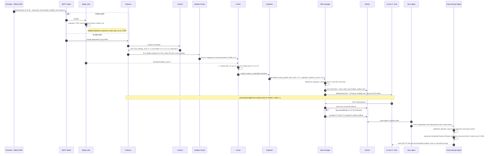

# 03 — Detailed AI Architecture and Data Flow

**Owner:** Edge AI Architect · **Depends on:** 00-design-brief, 04-ml-approaches (features, fusion, calibration), 05-digital-twin (data model), 08-training-loop, 13-evaluation (M-metrics), 14-critical-risks

Tag legend: [ESTABLISHED] cited fact · [HYPOTHESIS] untested belief · [PROPOSED] our design choice · [SIMULATED] produced on generator data.

## 1. Architectural stance

| Principle | Consequence |
|---|---|
| Two independent paths [PROPOSED] | **Safety path:** rules → broker → UI. It runs as its own process, has no ML imports and bypasses FastAPI. **Insight path:** features → anomaly → fusion → explainer → alert manager. It is advisory only. |
| Advisory, not certified | T-CRIT mirrors OEM interlocks and OEM detection systems (e.g., Cat Detect) and never replaces them. Cat notes that Detect may miss people at fast swing speeds [ESTABLISHED; Cat Detect page], which is one more reason fast swing counts as high exposure. We meet neither ISO 19014 (functional safety) nor ISO 21815-1 (collision warning) [ESTABLISHED; refs] (14 §2). |
| Edge-first | Rules, anomaly inference, alerts, incident log, task-time inference and cached training all work with no WAN. The cloud holds fleet history, profiles, the competency engine, LLM generation and training. |
| One schema | Simulator, replay, CAN and telematics adapters all emit `TelemetrySample` tagged with `source` (SIM/REPLAY/REAL) and tier. Moving to real data means swapping one adapter. |
| Tier A is not real-time | The ISO 15143-3 (AEMP 2.0) API serves data from the provider's server to client applications [ESTABLISHED; ISO/TS 15143-3; Cat Digital FAQ]. It feeds history and task time, not the cab. |

## 2. System data flow

Thick arrows are the deterministic safety path. Dotted arrows are optional or asynchronous links (WAN, post-shift).

```mermaid
flowchart LR
  subgraph SRC["Telemetry sources"]
    CAN["CAN / SAE J1939 gateway<br/>Tier B - MOCKED in MVP"]
    PROX["Proximity system e.g. Cat Detect<br/>Tier C - SIMULATED"]
    SIM["Telemetry simulator<br/>seeded scenarios - SIMULATED"]
    REP["Recorded replay JSONL"]
  end

  subgraph EDGE["Edge node - industrial PC or Jetson Orin Nano class"]
    BRK[("Mosquitto broker<br/>TCP 1883 and WebSocket 9001")]
    subgraph SAFE["Deterministic safety path - no ML imports"]
      RULE["Safety rule engine<br/>seatbelt, inner proximity zone, over-speed,<br/>sensor health, 1 Hz heartbeat"]
    end
    subgraph INS["Insight path - advisory only"]
      ING["Ingest and validation"]
      FEAT["Streaming feature extractor<br/>20 s window, 5 s stride"]
      CTX["Context engine<br/>task state, geofence zone,<br/>conditions, sensor variant"]
      ANOM["Anomaly detector<br/>Isolation Forest per machine x task"]
      MACH["Machine-health channel<br/>DTCs, hydraulic spikes, attribution"]
      FUS["Risk fusion<br/>rules + anomaly + context"]
      EXP["Explainer<br/>robust z vs baseline"]
    end
    ALM["Alert manager<br/>T0-T4 tiers, rate limit, ack, escalation"]
    ETA["Task-time estimator<br/>LightGBM quantile + CQR offset"]
    DB[("SQLite WAL<br/>events, incidents, windows, outbox")]
    API["FastAPI edge API<br/>REST + WebSocket"]
    SYNC["Sync agent<br/>store-and-forward outbox"]
  end

  UI["In-cab UI and operator dashboard<br/>React + Vite + Tailwind"]

  subgraph CLOUD["Cloud / fleet - optional connectivity"]
    CING["Ingest API - idempotent upsert"]
    PG[("PostgreSQL + TimescaleDB")]
    AEMP["Telematics API ISO 15143-3<br/>Tier A - MOCKED"]
    PROF["Operator profile<br/>baselines, competency states"]
    TRN["Training engine<br/>event to competency, re-assessment"]
    RAG["RAG copilot<br/>FAISS + BM25 + LLM API, verified citations"]
    SUP["Supervisor dashboard"]
    HIST["Historical analytics and model training"]
    REG["Model registry and monitoring<br/>drift, alert rate, feedback"]
  end

  CAN --> BRK
  PROX --> BRK
  SIM --> BRK
  REP --> BRK
  BRK ==>|"telemetry/raw QoS 0"| RULE
  RULE ==>|"safety/alert QoS 1 via broker, MQTT over WebSocket"| UI
  RULE -.->|"read-only mirror for incident logging"| ALM
  BRK --> ING --> FEAT
  CTX --> FEAT
  FEAT --> ANOM --> FUS
  FEAT --> MACH --> FUS
  CTX --> FUS
  RULE -->|"procedural flags"| FUS
  FUS --> EXP --> ALM
  ALM --> DB
  ALM -->|"WebSocket push"| API
  CTX --> ETA --> API
  API <--> UI
  DB --> SYNC
  SYNC -.->|"HTTPS batches when online"| CING
  AEMP -.-> CING
  CING --> PG
  PG --> PROF
  PG --> TRN
  PG --> SUP
  PG --> HIST --> REG
  PROF --> TRN --> RAG
  REG -.->|"signed model bundle, pinned by hash"| SYNC
  PROF -.->|"cached baselines and competency states"| SYNC
  RAG -.->|"post-shift modules, never in-cab while moving"| UI

  classDef safe fill:#FFEAE6,stroke:#C52320,stroke-width:3px,color:#000
  class RULE safe
```

Independence properties [PROPOSED; tested per 13 M1/M17]:
1. The rule engine subscribes to raw telemetry itself. Killing the ML/API process leaves T-CRIT working.
2. The UI receives `safety/alert` straight from the broker's WebSocket listener (`protocol websockets`) [ESTABLISHED; mosquitto.conf(5)].
3. The alert manager only *mirrors* T-CRIT into incidents and cannot delay or suppress it. Its QoS 1 persistent session means T-CRITs raised while it is down are queued by the broker (`max_queued_messages`, default 1000; `persistence true`) and logged on reconnect [ESTABLISHED; mosquitto.conf(5)].
4. A 1 Hz rule-engine heartbeat. After 3 missed beats the UI shows a persistent **PROTECTION DEGRADED** banner, never green (14 §2).

## 3. One alert, end to end

Scenario [SIMULATED]: Ravi, truck-loading zone, fast swing near the truck. The seatbelt is fastened, so no T-CRIT fires. The ML path escalates to T2.

**In-cab gate** [PROPOSED; reconciles 04 §5.3 with 14 C4]: an ML-driven T1/T2 reaches the cab only with a deterministic precondition, either m_E ≥ 1.0 (loading zone, travel lane, truck or person nearby) or a procedural rule hit. Everything else goes to the T0 post-shift queue.

## 4. Component table

| Component | Responsibility | Tech (MVP) | Why chosen (alternative rejected) | Placement · offline |
|---|---|---|---|---|
| Source adapters | Decode into `TelemetrySample`; tag tier and source | Python, pydantic; `python-can` + DBC in P2 (unverified on a real gateway) | One schema decouples the simulator from real data | Edge (CAN, sim), cloud (AEMP) · local |
| MQTT broker | Local pub/sub, QoS, WebSocket to UI | Mosquitto 2.x | Lightweight pub/sub for constrained networks [ESTABLISHED; OASIS MQTT 5.0]. Kafka is too heavy for one node; HTTP polling adds latency | Edge · unaffected by WAN |
| Safety rule engine | Seatbelt while moving, inner zone, over-speed; stale/stuck/NaN → fault alert | Python stdlib + pydantic, `rules.yaml`, pytest + hypothesis | Separate process, no ML dependencies, table- and property-tested | Edge · full |
| Feature extractor | Ring buffers → F1–F23 (04 §4) | numpy | Deterministic and ms-level; pandas rolling is too slow per sample | Edge · full |
| Context engine | Task state (schedule, tap, inferred truck), zone, conditions, m_E, sensor variant | Python, shapely | Gates must be auditable, not learned | Edge · cached; weather marked stale |
| Anomaly detector | IF per (machine × task) with back-off (04 §8); score → percentile | scikit-learn IF (100 trees, 256 samples); ONNX Runtime via skl2onnx in P2 | Needs no labels [Liu 2008]; IF is convertible [ESTABLISHED; sklearn-onnx docs] | Edge inference, cloud training · full, hash-pinned |
| Machine-health channel | DTCs, hydraulic spikes, sensor health, attribution (04 §5.4) | Rules + EWMA/CUSUM | Keeps machine faults out of competency (R4) | Edge flags; cloud cross-operator · flags only |
| Risk fusion | 04 §5.3 formula + in-cab gate | Python, `fusion.yaml` | Hand-set, auditable; no labels to learn weights | Edge · full |
| Explainer | Top robust-z deviations → template; TreeSHAP post-shift | numpy; `shap` in cloud | z is cheap and in operator units; SHAP is for engineers (04 §7) | Edge z, cloud SHAP · z only |
| Alert manager | Tiers, dedupe, rate limits, ack, T3/T4 timers, T0 queue, incidents | asyncio in edge API | One tested state machine owns alarm-flood behaviour | Edge · T4 queued |
| Task-time estimator | P10/P50/P90 at start and on progress | LightGBM booster + per-stratum CQR offset [Ke 2017; Romano 2019] | Native quantile objective; the conformal offset is one number | Edge inference, cloud training · full |
| Edge store | Events, incidents, windows, 72 h raw ring, outbox | SQLite (WAL) | Embedded, transactional, zero-admin; readers run alongside one writer [ESTABLISHED; sqlite.org/wal]. Postgres adds a server for no gain | Edge · system of record |
| Edge API | REST + WebSocket, OpenAPI contract | FastAPI + Uvicorn | Async WebSocket; pydantic schemas shared with sim and rules; generated OpenAPI for the frontend; same language as the ML | Edge · full |
| Sync agent | Outbox upload; pull models, baselines, corpus | httpx, UUID idempotency | Explicit priority and idempotency are easier to verify than bridging DB rows over MQTT | Edge · accumulates, resumes |
| UI | Five pages (10 §7) | React + Vite + Tailwind, mqtt.js | Fast HMR; Tailwind carries the ui-theme.md tokens; one codebase for dark cab and light office views | Edge (operator), cloud (supervisor) · cached shell |
| Cloud DB | History, profiles, competency, audit, RAG metadata | PostgreSQL 16 + TimescaleDB | Relational audit integrity plus time-series hypertables [ESTABLISHED; Timescale docs]. Falls back to plain Postgres | Cloud |
| Profile + training engine | Baselines, gap evidence, states, re-assessment (05, 08) | pandas, scipy, statsmodels | Transparent statistics without labels | Cloud post-shift; baseline recompute may run on the edge (05 §5.7) · deferred ("pending sync") |
| RAG copilot | Retrieve, generate, verify citations in code, extractive fallback (08 §8.5) | FAISS `IndexFlatIP` + BM25, `bge-small-en-v1.5` | Exact search on < 10k chunks needs no server [Johnson 2017]; Chroma is an acceptable swap | Cloud generation, edge extractive · extractive |
| LLM API | Draft modules for approval; non-safety-critical Q&A | Hosted LLM behind a wrapper | Quality without GPU hosting; never on the safety path or in-cab | Cloud · unavailable → extractive |
| Model registry + monitoring | Artefacts, model cards, drift, alert rate, feedback | `models/` + `model_registry` + SHA-256; MLflow later | A file registry is enough for 3–6 models | Cloud source, edge pinned · last-good |
| **Redis** | **Not used** | — | In-process state, SQLite and MQTT already cover cache, queue and pub/sub on one node. Revisit for a horizontally scaled cloud API | — |

## 5. Edge constraints

### 5.1 Latency budget [PROPOSED; measured per 13 M4/M16]

| Rule path (from publish of the sample that satisfies the debounced rule) | Budget | ML path (from window close) | Budget |
|---|---|---|---|
| Broker → rule engine (localhost, QoS 0) | ≤ 10 ms | Features (≤ 200 samples × ~15 signals) | ≤ 10 ms |
| Parse, validate, evaluate ≤ 50 rules | ≤ 7 ms | Context (point-in-polygon, task state) | ≤ 5 ms |
| `safety/alert` (QoS 1) → UI over WebSocket | ≤ 20 ms | IF score, native sklearn, single row | ≤ 30 ms (ONNX lower [HYPOTHESIS]) |
| React update, paint, audio start | ≤ 60 ms | Fusion + explainer | ≤ 5 ms |
| Margin (GC, jitter) | ~100 ms | Alert manager + SQLite transaction | ≤ 30 ms |
| | | WebSocket push + render | ≤ 80 ms |
| **Target p99 < 200 ms** (13 M4 ceiling: 500 ms) | | **Target p95 < 1 s** (typical ~160 ms) | |

- Debounce is part of the rule spec, e.g., seatbelt open AND travel > 0.5 km/h for ≥ 1 s (04 §3), and is reported separately.
- Detection latency (onset → alert) is dominated by the 20 s window and 5 s stride; 13 M4 sets p50 ≤ 15 s. Anything that needs a sub-second response must be a rule.
- Measurement: messages carry `t_pub_ns` on one host clock, and the UI posts `t_render` to `/api/v1/metrics/latency`.

### 5.2 Compute and footprint

| Item | Target |
|---|---|
| Hardware | Fanless x86 industrial PC (4 cores, 8 GB) or Jetson Orin Nano class (6-core Arm Cortex-A78AE, 7–25 W modes) [ESTABLISHED; NVIDIA]. Models are CPU-only; the GPU stays free for vendor perception or P2 temporal models. A laptop stands in for the MVP |
| CPU / RAM | ≤ 25 % of one core on average; ≤ 1 GB RSS for broker + rules + API [PROPOSED] |
| Models | IF 1–3 MB × 4; LightGBM < 3 MB; total < 50 MB [HYPOTHESIS: measure] |
| Storage | Raw 10 Hz × ~30 signals ≈ 110 MB per 10 h shift in a 72 h ring; windows ≈ 10 MB/shift [estimate] |

### 5.3 Degraded modes and store-and-forward

| Failure | Behaviour |
|---|---|
| WAN down | All edge functions continue. Outbox grows. RAG goes extractive. Bookings and T4 are queued. Weather is marked stale |
| ML/API crash (missing `health/edge-ml`) | Rules unaffected. UI shows "advisory ML offline". Supervised restart |
| Rule engine or broker down (3 s without heartbeat) | Persistent red PROTECTION DEGRADED; auto-restart; incident logged |
| Stale, stuck or NaN sensor | Sensor-fault alert, never "OK" (13 M1) |
| Tier C absent | B-only IF variant plus "proximity not monitored" banner (04 §4, 13 M18) |
| Model hash mismatch | Keep last-good model. If none, disable ML; rules continue |
| Disk pressure | Purge raw, then windows. Never purge unsynced events or incidents |

**Outbox** [PROPOSED]:
- Each row carries a UUID, `schema_version` and a priority: P0 incidents and T-CRIT, P1 alerts and acks, P2 windows, P3 downsampled raw.
- Rows upload in priority order, in batches of ≤ 500, with exponential backoff.
- The cloud upserts on UUID. At-least-once delivery plus idempotency gives no loss and no duplicates (13 M17).
- Clock offset is recorded at every sync.
- Models arrive as signed, hash-pinned bundles, swapped atomically with rollback. Rule thresholds change only through reviewed config.

## 6. Model monitoring [PROPOSED]

| Monitor | Metric → trigger | Action |
|---|---|---|
| Feature drift | Daily PSI + KS per feature per context vs the training reference. The PSI 0.10/0.25 bands are a rule of thumb whose error rate depends on sample size [ESTABLISHED; Yurdakul 2018], so use bootstrap critical values. Two-sample shift tests follow Rabanser 2019 | Flag the context; queue a retrain candidate |
| Null calibration | Share of windows with p ≥ 0.99 outside 0.7–1.3 % for 3 days (13 M5) | Recompute the ECDF |
| Alert rate | Average and peak rate per operator, floods and chattering, which are the analyses ISA-18.2 recommends per operating position [ESTABLISHED; ISA-18.2 guide]. Trigger: above B_T1 ≤ 1.0/h or B_T2 ≤ 0.2/h (04 §6). The process benchmark is under 1 alarm per 10 min (EEMUA 191, via 14 §3); an operator driving a machine likely tolerates less [HYPOTHESIS] | Raise τ, tighten the in-cab gate |
| Operator feedback | Post-shift "useful / not useful / wrong context" labels, plus instructor review of a random 10 % sample to counter dismissal bias. Trigger: relevance precision < 50 % for a signature | Retune. With ≥ 50 labels per class, fit isotonic relevance calibration (04 §6). These are relevance labels, not incident labels |
| Interval coverage | Rolling P10–P90 coverage per stratum outside 0.75–0.85 (13 M11) | Recompute the CQR offset |
| Rule health | Firing counts; a seatbelt switch that never toggles over N shifts | Maintenance or tamper check, never discipline |
| Promotion | ≥ 1 week of shadow scoring on the edge with alert rate and M5 in band | Human approval → staged rollout |

## Challenge to brief

1. **"< 1 s for ML alerts" holds only as processing latency.** Onset-to-alert takes seconds with 20 s windows (13 M4). Sub-second protection is the rules' job.
2. **Rename "critical protections" to "critical safety advisories".** They are not an ISO 19014 safety function (agrees with 14 C1).
3. **The React UI is a single point of failure for T-CRIT.** The MVP has the heartbeat banner. Production needs an independent buzzer or light, and a rule engine that reads the CAN gateway directly.
4. **Tier A telematics cannot drive the edge.** The AEMP 2.0 API is server-to-client, so it serves history and task time only.

## References

- ISO/TS 15143-3:2020, Telematics data — https://www.iso.org/standard/76394.html
- Cat Digital, ISO 15143-3 (AEMP 2.0) API FAQs — https://digital.cat.com/knowledge-hub/faq/iso-15143-3-aemp-20-api-faqs
- Cat Detect, People Detection — https://www.cat.com/en_US/products/new/technology/detect/detect/117380.html
- ISO 19014-1:2018, Functional safety — https://www.iso.org/standard/70715.html
- ISO 21815-1:2022, Collision warning and avoidance — https://www.iso.org/standard/77302.html
- OASIS MQTT v5.0 — https://docs.oasis-open.org/mqtt/mqtt/v5.0/mqtt-v5.0.html
- mosquitto.conf(5) (websockets listener, bridges, persistence) — https://mosquitto.org/man/mosquitto-conf-5.html
- SQLite Write-Ahead Logging — https://www.sqlite.org/wal.html
- TimescaleDB documentation (PostgreSQL extension, hypertables) — https://www.tigerdata.com/docs/
- sklearn-onnx supported models — https://onnx.ai/sklearn-onnx/supported.html
- ONNX Runtime — https://onnxruntime.ai/
- NVIDIA Jetson Orin — https://www.nvidia.com/en-us/autonomous-machines/embedded-systems/jetson-orin/
- Liu, Ting, Zhou 2008, Isolation Forest — https://dl.acm.org/doi/10.1109/ICDM.2008.17
- Ke et al. 2017, LightGBM — https://papers.nips.cc/paper/6907-lightgbm-a-highly-efficient-gradient-boosting-decision-tree
- Romano, Patterson, Candès 2019, CQR — https://papers.nips.cc/paper/8613-conformalized-quantile-regression
- Johnson, Douze, Jégou 2017, FAISS — https://arxiv.org/abs/1702.08734
- Rabanser, Günnemann, Lipton 2019, Failing Loudly (dataset shift detection) — https://arxiv.org/abs/1810.11953
- Yurdakul 2018, Statistical Properties of the Population Stability Index — https://scholarworks.wmich.edu/dissertations/3208/
- ISA, Understanding and Applying ANSI/ISA-18.2 — https://www.isa.org/getmedia/55b4210e-6cb2-4de4-89f8-2b5b6b46d954/PAS-Understanding-ISA-18-2.pdf
