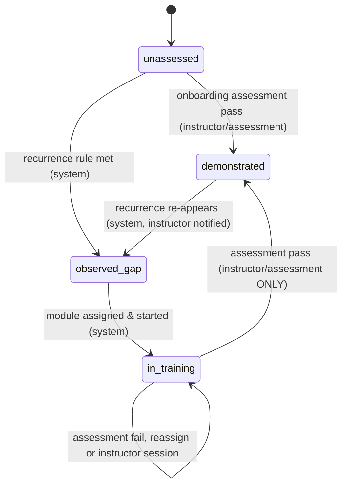

# 05 — Operator Digital Twin Design

**Scope.** The MVP (P0/P1) ships a lightweight **Operator Profile**: per-context baseline stats, competency states, and training, exposure and break history. The full operator digital twin is **P2**. The profile is the data that powers the Train → Evaluate → Adapt part of the loop (see `08-training-loop.md`).

## 5.1 Naming and positioning

- [ESTABLISHED] The human-digital-twin (HDT) literature describes a twin as a virtual counterpart coupled to the human entity through an interactive system. It often includes physiological, cognitive and ergonomic state, not just a behavior log ([HDT in Industry 5.0 review](https://www.sciencedirect.com/science/article/abs/pii/S0736584523001011); [HDT systematic review & concept disambiguation](https://www.sciencedirect.com/science/article/abs/pii/S0166361524001581)).
- [PROPOSED] The MVP has none of that state, so the UI and code call it **"Operator Profile"**. The word "digital twin" appears only on the P2 roadmap slide, which avoids overclaiming to judges.

## 5.2 Is the profile/twin justified?

| Question | Answer |
|---|---|
| What problem? | Fleet-wide thresholds can't tell a novice who keeps swinging fast near trucks from an experienced operator working a hard context. Training is assigned by calendar, not by need. |
| Who uses it? | The **operator** sees their own progress and evidence. The **instructor** sees who needs what and records verification. The **supervisor** sees crew-level readiness only, with no individual risk ranking by default. The **system** uses it for context-normalized comparison, training recommendations and re-assessment scheduling. |
| Data needed | Event log with context; exposure per context (hours and opportunities); windowed features (10–30 s); training and assessment records; break log. |
| Is it available? | Tier A exposure/idle/fuel/GPS: typically yes via telematics. Tier B (swing rate, seatbelt switch, joystick): not guaranteed, so use the SIMULATED generator. Tier C proximity: optional. Verified competency labels: **Tier D, unavailable**. They are created from now on by instructors and assessments, never inferred. |
| Why AI? | Honest answer: the MVP is mostly **statistics**, not deep learning. The value comes from empirical-Bayes context normalization plus the Isolation Forest window scores from R4. Rules alone can't normalize by exposure and context. Heavy ML isn't justified without labels. |
| Action enabled | Targeted module assignment, instructor prioritization, re-assessment scheduling, and measured improvement on the targeted behavior. |
| Metric | Instructor agreement with flagged gaps (target ≥70%, [PROPOSED]); change in targeted event rate per exposure in matched context; time from gap to demonstrated. |
| Demo-able? | Yes. Ravi's profile card changes state across Shift 1 → post-shift → Shift 2 [SIMULATED]. |

## 5.3 Three epistemic layers (non-negotiable)

| Layer | Contains | Written by | Example | Allowed uses | Forbidden |
|---|---|---|---|---|---|
| **Observed behavior** | Facts from telemetry and the app, append-only | System | "Seatbelt switch open while travel speed >0.5 km/h, 14:02–14:03" | Incident log, evidence shown to operator | Editing after the fact (corrections only as annotations) |
| **Inferred risk / propensity** | Model outputs with confidence, model version and baseline version | System (ML/stats service) | "P(swing-exceedance rate > reference) = 0.86 in truck-loading, 320D-class" | Coaching suggestions, training recommendations, instructor queue ordering | Authorization, discipline, pay, being displayed as fact |
| **Verified competency** | Assessment outcome | **Instructor, or a scored assessment with versioned pass criteria** | "Approach & swing control: demonstrated (sim + on-machine observation, 2026-09-20)" | Training records, instructor planning | Being set or changed by any model |

[PROPOSED] Enforcement is in code, not by convention. `PATCH /competency/{id}/state` with `state=demonstrated` requires `role=instructor` or an `assessment_id` with `result=pass`. The ML service account has no write permission on that field. Every state change goes to an audit log.

## 5.4 Data model (SQLite on edge; same schema in PostgreSQL for cloud)

**Context key** = `machine_type × task_type × condition_bucket`. Example: `EX-20t × truck_loading × {dry, day}`. Condition buckets stay coarse (ground: dry/wet/soft; light: day/night) so that strata don't become empty.

| Table | Key fields |
|---|---|
| `operator` | `operator_id` (pseudonymous), `site_id`, `experience_band` (novice <500 h / intermediate / experienced; [PROPOSED] bands), `onboarding_date`, `consent_flags` |
| `shift` | `shift_id`, `operator_id`, `machine_id`, `start`, `end`, `conditions` (weather, ground, lighting) |
| `competency_catalog` | `competency_id`, `name`, `applies_to`, `safety_critical`, `catalog_version` (contents in 08) |
| `operator_competency` | `operator_id`, `competency_id`, `state` ∈ {unassessed, observed-gap, in-training, demonstrated}, `state_source` ∈ {system, instructor, assessment}, `changed_by`, `changed_at`, `evidence` (JSON: n_events, n_shifts, exposure, posterior_p, confidence), `behavior_trend` ∈ {improving, stable, worsening, insufficient_data}, `reassess_due` |
| `context_baseline` | `level` ∈ {population, machine_type, task, operator}, `context_key`, `operator_id` (nullable), `feature`, `n_windows`, `mean`, `var`, `q10/q50/q90`, `shrinkage_w`, `baseline_version`, `computed_at` |
| `expert_envelope` | `context_key`, `phase` (dig / swing-loaded / dump / swing-empty / travel), `feature`, `p10/p50/p90`, `n_experts`, `n_cycles`, `safety_cap`, `envelope_version`, `validated_by` |
| `event` | `event_id`, `operator_id`, `machine_id`, `shift_id`, `ts_start/ts_end`, `event_type`, `alert_tier` (T-CRIT, T0–T4), `source` ∈ {rule, anomaly, manual}, `context_key`, `task_state`, `feature_deviations` (top-k z-scores), `anomaly_score`, `attribution` ∈ {operator, machine, environment, unknown}, `rule_version`, `model_version`, `baseline_version`, `dispute_status` |
| `exposure` | `operator_id`, `shift_id`, `context_key`, `operating_h`, `idle_h`, `opportunities` (e.g., truck-loading cycles, km travelled) |
| `training_record` | `operator_id`, `competency_id`, `module_id`, `module_version`, `assigned_reason` (event_ids), `assigned_at`, `completed_at`, `quiz_score`, `attempts`, `sim_score`, `instructor_session_id` |
| `assessment` | `assessment_id`, `operator_id`, `competency_id`, `type` ∈ {quiz, scenario, sim, on-machine observation}, `score`, `pass_criteria_version`, `assessor_id`, `result` |
| `break_log` | `operator_id`, `shift_id`, `break_start/end`, `source` ∈ {app, inferred_engine_off}, `continuous_operation_min_before` |

Profile view returned to the dashboard (abridged) [SIMULATED values]:

```json
{"operator_id":"op_ravi_demo","experience_band":"novice",
 "competencies":[{"id":"C04","name":"Approach & swing control near trucks",
   "state":"observed-gap","state_source":"system",
   "evidence":{"n_events":7,"n_shifts":2,"opportunities":81,"posterior_p":0.91,"confidence":"high"},
   "behavior_trend":"insufficient_data","reassess_due":"after 30 loading cycles post-training"}],
 "exposure_h":{"EX-20t|truck_loading|dry,day":11.5},
 "baseline_version":"bl-2026-09-22-03","label":"SIMULATED"}
```

## 5.5 Competency state machine



`behavior_trend=improving` is an **observed** attribute. It schedules an assessment and never changes the state by itself. When the system moves `demonstrated` back to `observed-gap`, the historical assessment record is kept.

## 5.6 Expert reference patterns

[ESTABLISHED] Skill differences between novice and experienced operators can be measured from control and implement sensor data. Bernold instrumented a backhoe simulator to quantify operator skill ([Bernold 2007](https://ascelibrary.org/doi/10.1061/(ASCE)0733-9364(2007)133:11(889))). In a 7-day simulator study, novices using joysticks were consistently worse than experts, although they improved ([J. Comput. Civ. Eng. 40(6)](https://doi.org/10.1061/JCCEE5.CPENG-7488)). The operator's effect on digging-machine energy efficiency can also be evaluated from data ([Energy Efficiency, 2015](https://link.springer.com/article/10.1007/s12053-015-9353-3)).

| Step | Rule [PROPOSED] |
|---|---|
| **Select experts** | (1) ≥2 years or ≥2,000 h on that machine class; (2) no recordable incident or T-CRIT event in the last 12 months; (3) **nominated and validated by an instructor**, based on safe technique, not output; (4) productivity only as a tie-breaker. Speed alone never qualifies anyone. |
| **Normalize** | Build envelopes per context key and per work-cycle phase. Phases come from rule-based segmentation on swing angle and boom pressure. Express features per cycle (peak swing rate, swing acceleration, bucket height at truck, jerk), not per minute. |
| **Exclude** | Windows with any rule event, proximity warning, over-speed, or seatbelt violation. Cycles above the site safety cap, even when they come from experts. Windows with sensor faults or machine-attributed faults. |
| **Represent** | **Distributions (envelopes)**: P10/P50/P90 per phase × feature × context. Published envelope = expert band ∩ site/OEM safety cap. Minimum support before an envelope is used: ≥3 experts and ≥50 cycles per context. Below that, use the site rule only. |
| **Use** | "Your peak swing rate near the truck was above the validated-expert P90 in 6 of 40 cycles." This is a comparison against a band, used only post-shift (T0). |

**Warning: do not imitate raw expert control.** [HYPOTHESIS] Expert joystick traces encode anticipation, visual cues and machine-specific feel that telemetry does not capture. Their speed is safe only because of that perception. Coaching novices to copy expert trajectories or cycle times could raise risk. So envelopes coach **bounds and smoothness**, never "go faster". Envelopes also carry survivorship bias: a clean 12-month record may be partly luck. That is why instructor validation is required.

## 5.7 Hierarchical baselines, shrinkage and cold start

**Hierarchy:** population → machine type → task (machine × task × condition) → operator. If a parent node has fewer than 200 windows, the estimate backs off one level.

**Feature means (Gaussian, empirical Bayes)** [ESTABLISHED method: [Efron & Morris 1975](https://www.tandfonline.com/doi/abs/10.1080/01621459.1975.10479864)]:

`μ̂_op,c = w·x̄_op,c + (1−w)·μ_parent(c)`, with `w = n/(n+κ)` and `κ = σ²_within / τ²_between`. κ is estimated by method of moments across operators at the parent level, with a floor of κ ≥ 20 windows [PROPOSED].
Variances: use the pooled parent variance until n_op,c ≥ 200 windows, then shrink the log-variance the same way.

**Event rates (Gamma–Poisson):** `λ_op,c ~ Gamma(α_c, β_c)`, with the prior fitted by method of moments on operator rates at the parent level. The posterior is `Gamma(α_c + k, β_c + E)`, where k is the event count and E the exposure (opportunities or hours). Gap evidence is `P(λ > r_ref)` from `scipy.stats.gamma`. r_ref is the expert-envelope exceedance rate or the site target. All of this runs in pandas/scipy with no probabilistic-programming dependency.

**Key principle [PROPOSED]: a personal baseline never defines "safe".** Safety comparisons (T1/T2 and gap detection) are made against the **reference envelope and rules**. The personal baseline is used only for (a) measuring change and improvement and (b) P2 drift hypotheses. A personal baseline is never allowed to widen an advisory threshold. Otherwise a novice's risky habit would become "normal".

**Cold start** [PROPOSED]:

| Stage | Baseline used | Thresholds | Competency states |
|---|---|---|---|
| Day 0 (no data) | machine × task priors | T-CRIT fixed (never personalized). T1/T2 from the reference envelope. | Onboarding assessment (quiz + instructor yard check + sim if available) sets passed competencies to `demonstrated`. The rest stay `unassessed`. |
| 0–20 h in context | Shrunk estimate, w small | Reference envelope. Coaching T0 only. Recurrence rule unchanged (≥3 events / ≥2 shifts). | Novice band: instructor gets a daily digest suggestion |
| 20–100 h | w ≈ 0.5–0.8 | Same | Gap detection active |
| >100 h | Operator-level informative | Same, plus P2 change detection | Normal |

**Update rules** [PROPOSED]:

| Aspect | Rule |
|---|---|
| Cadence | Nightly or post-shift batch on the edge. Re-sync to the cloud when a connection is available. |
| Eligible windows | Sensor-healthy, `attribution≠machine`, no active T-CRIT/T2 event. Training-period windows are included but tagged. |
| Forgetting | Exponential weighting with a 40-operating-hour half-life per context (tune on data) |
| Versioning | Every recompute creates a new `baseline_version`. Events store the version they were scored against. Keep the last 5 versions. |
| Guardrails | Operator baselines are clipped to the reference envelope for thresholding. Drift of an operator's baseline toward riskier values is logged as an observation for the instructor. |

**Relation to knowledge tracing.** [ESTABLISHED] Bayesian Knowledge Tracing maintains, per skill, a probability that the learner has mastered it, updated at each practice opportunity ([Corbett & Anderson 1994](https://link.springer.com/article/10.1007/BF01099821)). An implementation is available in [pyBKT](https://arxiv.org/abs/2105.00385). [HYPOTHESIS] BKT could be adapted with one opportunity = one context window where the competency can be exercised, and outcome = within envelope. This is deferred to P2 for three reasons: BKT expects clean correct/incorrect outcomes, it needs labelled sequences to fit, and the standard model has no forgetting. The MVP's Gamma–Poisson rates are more transparent and need no labels.

## 5.8 MVP vs deferred (P2)

| Capability | MVP | P2 |
|---|---|---|
| Per-context baselines + shrinkage | Yes | Full Bayesian hierarchical model (PyMC) |
| Competency states + evidence | Yes | BKT-style latent skill tracing |
| Expert envelopes | Built from SIMULATED "expert" profiles | Real validated experts |
| Temporal behavior models | — | GRU/TCN autoencoder per operator |
| Fatigue-risk indicator | — | Research hypothesis only, never a diagnosis |
| What-if simulation ("how would Ravi do on a slope task?") | — | Twin coupled to a simulator |
| Multimodal (camera, wearables) | — | Tier C fusion, consent-gated |

## 5.9 Privacy and governance

- Purpose limitation: the profile exists for coaching and training, never for automatic employment or authorization decisions (brief safety principles).
- The operator can see all of their own evidence and can dispute an event (`dispute_status`). Disputes go to the instructor.
- Supervisors see crew aggregates by default. Individual drill-down requires instructor role and is audit-logged.
- Retention: raw windows 90 days, then aggregated. Events and training records follow site policy [PROPOSED].

## Challenge to brief

1. **The demo's recurrence rule conflicts with a single-shift story.** "≥3 events across ≥2 shifts" can't fire after Shift 1 alone. Proposal: seed Ravi's profile with one SIMULATED prior shift (Shift 0, 2 events), so the gap is flagged honestly post-Shift 1.
2. **Counts need exposure normalization.** "≥3 events across ≥2 shifts" should be a *floor*. It should be combined with `P(λ > r_ref) ≥ 0.8`, otherwise operators who get more truck-loading hours are flagged more.
3. **Shift 2 must not set "demonstrated".** Fewer events set `behavior_trend=improving` and schedule an assessment. Only an instructor or a scored assessment sets `demonstrated`. The demo shows a mock instructor sign-off.
4. **Call it "Operator Profile" in the MVP**; reserve "digital twin" for P2.
