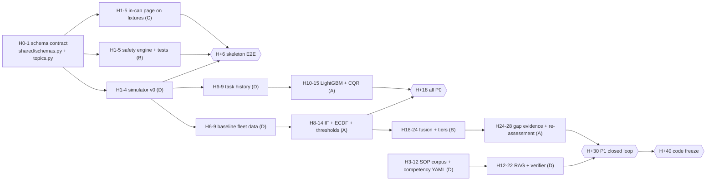

# 11 — Step-by-Step Hackathon Execution Roadmap

**Owner:** Hackathon Technical Strategist · **Depends on:** 03-architecture, 10-mvp (acceptance criteria AC*), 13-evaluation, 14-critical-risks

Tag legend: [PROPOSED] unless stated. Budget: 4 people × 48 h ≈ 120–150 productive person-hours (14 §6) [HYPOTHESIS].

## 1. Roles

| Person | Role | Owns | Decision rights |
|---|---|---|---|
| **A** | ML engineer | Features (with B), IF training, ECDF, alert-budget thresholds, z-explainer, LightGBM + CQR, evaluation scripts (13 M2/M3/M5/M11), model cards, gap evidence and re-assessment stats | Model and threshold choices |
| **B** | Backend / edge engineer (tech lead) | Schemas and topics, Mosquitto, safety engine and tests, edge-api (pipeline host, alert manager, SQLite, sync), cloud-api, docker, latency and offline tests | Architecture and merge to `main` |
| **C** | Frontend engineer | React + Vite + Tailwind, five pages, MQTT-WS client, OpenAPI client, theme (ui-theme.md), SIMULATED watermarks, demo-control panel | UX |
| **D** | Data / simulation + RAG + pitch (PM) | Dataset audit, simulator and injectors, scenarios and recordings, competency YAML, SAMPLE SOP corpus, RAG pipeline and verifier, demo script, deck, backup video | Scope and cut list, timekeeping |

Hygiene rule (14 §1): **D writes the injectors, A tunes the detectors.** Injection types U3 and U4 stay hidden from A until evaluation.

## 2. Critical path

Longest chain: schema → simulator → baseline data → IF → fusion → gap evidence → Shift 2 re-assessment. **The simulator is the first dependency for everyone**, so D starts it in hour 1 and ships v0 by H+4, even if it is crude.

## 3. Hour-by-hour plan (48 h)

| Hours | A — ML | B — Backend/edge | C — Frontend | D — Data/sim/RAG/pitch |
|---|---|---|---|---|
| 0–1 | All: read brief and sections, freeze scope (10 §1), write `schemas.py` + `topics.py` together, create repo, set branch rules | ← | ← | ← |
| 1–3 | Audit supplied dataset with D: map columns to tiers, feature-feasibility matrix | Mosquitto config (WS listener), safety engine skeleton, seatbelt rule + truth-table tests | Vite + Tailwind + theme tokens, routing, `/cab` layout, mqtt.js client | Dataset audit (with A). Simulator v0: travel, swing, seatbelt, distances, idle, 10 Hz |
| 3–6 | Feature extractor (F5, F7, F8, F12, F20 first), windowing tests | edge-api skeleton, SQLite schema, alert mirror → incident, `/ws/live`, `/health` | TCritOverlay, ProtectionStatus (heartbeat), Incident Log on fixtures | `ravi_shift1.yaml` v0, `sim/control` hotkeys, first JSONL recording |
| **H+6** | **CP1 skeleton E2E:** sim → broker → safety → T-CRIT on `/cab` via MQTT-WS; incident row in SQLite shown on `/incidents`; stub score on WS; `make demo` runs on both laptops. **If it fails, everyone swarms until it passes** | | | |
| 6–10 | Remaining features; IF v1 on baseline fleet data; per-context ECDF | Proximity, over-speed, sensor-health rules; idle rule + context gate; context engine (geofence, task state) | Operator Home: tasks, progress, checklist gating, conditions card | Baseline fleet scenarios (4 operators, 2 machines), task-history generator for ETA, injector library U1–U7 |
| 10–14 | Alert-budget thresholds (04 §6); LightGBM quantiles | Checklist and task APIs, ETA endpoint, alert manager tiers v0, outbox table | EtaBand, In-cab AlertBanner + ACK, "Waiting for truck" toggle | Competency YAML, 10–20 SAMPLE SOP chunks, training modules + quizzes |
| 14–18 | CQR calibration; M3/M5/M11 scripts; model cards | Rule property tests (hypothesis), latency harness (`t_pub_ns` → `t_render`) | Training Hub v0: modules, quiz, mock booking; Incident detail drawer + manual entry | RAG ingest + FAISS/BM25 + extractive answers; record P0 replay files |
| **H+18** | **CP2 all P0:** AC1.1–1.3, AC2.1–2.5, AC4.3, AC5.1–5.2 pass; P0 beats recorded as replays. Anything red is either fixed by H+20 or moved down the cut list (§6) | | | |
| 18–19 | Integration hour: merge, rerun all tests, 15-min stand-up | ← | ← | ← |
| 19–24 | **Sleep** | Fusion + in-cab gate + T2/T3/T4 timers; machine-health channel | **Sleep** | Citation verifier (sentence → chunk, number string-match); LLM prompt; 40-question gold set |
| 24–29 | Robust-z explainer + templates; gap evidence (Gamma–Poisson); re-assessment GLM | **Sleep** | Explanation chips; Supervisor view; competency grid; before/after chart | **Sleep** |
| 29–30 | Shift 0 seed + Shift 2 scenario checks with D | Sync agent + cloud ingest (or SQLite cloud fallback) | Copilot panel with mode badge | Shift 0 / Shift 2 scenarios; recordings |
| **H+30** | **CP3 P1:** the closed loop runs on replay: Shift 1 events → C04 gap → cited module → quiz → booking → Shift 2 → `improving` + RR/CI. Independence test (AC2.3) and offline test (AC1.4) pass. **Backup video v1 recorded** | | | |
| 30–34 | M2 injected evaluation incl. hidden U3/U4, robust-z baseline comparison; drift/alert-rate data | Offline fault scripts (M17), kill-ML test, disk-pressure purge, heartbeat banner | Polish: contrast, 64 px targets, SIMULATED watermarks, loading/error states | Deck v1 (problem, data reality, architecture, what's real), demo script v1 |
| 34–36 | Stretch only if CP3 is green: TreeSHAP post-shift, ONNX export | Bug fixes | Bug fixes | Rehearsal 1 (timed), fix list |
| **H+36** | **Feature freeze** (T−12 h, per 14 §6). Only fixes from here | | | |
| 36–40 | Final metrics tables, labelled SIMULATED, into the deck | Precompute fallback outputs (`scripts/precompute_outputs.py`), pin versions, tag `v1.0-demo` | Final UI fixes, demo-control panel hidden behind hotkey | Rehearsals 2–3, Q&A bank, backup video v2 (full run) |
| **H+40** | **CP4 code freeze:** all AC green or explicitly cut and disclosed; both laptops run the demo from a clean reset; backup video and precomputed outputs verified | | | |
| 40–44 | Q&A prep (ML questions) | Venue setup script, network-off rehearsal | Sleep | Sleep, then deck final |
| 44–48 | Rehearsal 4 with all roles, then buffer. Nothing merges without two reviewers | ← | ← | ← |

**36 h variant.** Scale checkpoints to H+5 (skeleton), H+13 (P0), H+22 (P1), H+27 feature freeze, H+30 code freeze. Use one 4 h sleep block per pair. Pre-cut items 1–4 from §6 at the start.

**Rituals.** Stand-up of 10 minutes at every checkpoint and every 6 h in between. Merge to `main` at least every 2 h, behind green `pytest -q` and `npm run build`. D keeps a visible cut-list board.

## 4. Dependency contract (hand-offs)

| Producer → consumer | Artefact | Needed by |
|---|---|---|
| All → all | `schemas.py`, `topics.py`, OpenAPI stub | H+1 |
| D → B, A | Simulator v0 publishing `telemetry/raw` | H+4 |
| A + B | Feature list v1 (names, units, windows) | H+4 |
| D → A | Baseline fleet data (≥ 7 h of clean windows per context, to resolve p = 0.999, 04 §6) and task history | H+9 |
| B → C | `/ws/live` frame types; REST routes behind generated client | H+6 (stubs), H+14 (real) |
| A → B | `anomaly.predict()`, `eta.predict()` interfaces + model files + hashes | H+12 (v1), H+18 (final P0) |
| D → A, C | Competency YAML, module JSON, Shift 0/2 scenarios | H+14, H+29 |

## 5. Top critical risks and fallbacks

| # | Risk | Early signal | Fallback | Owner |
|---|---|---|---|---|
| 1 | Live MQTT/sim pipeline fails at the venue | Any failed rehearsal; venue network blocks ports | **Recorded replay** through the same pipeline (`sim.replay`). If that fails, play the backup video, narrated live | B |
| 2 | Supplied dataset unusable, or arrives late | H+3 audit shows only Tier A daily rows | Simulated track as planned; real columns feed only a Tier A panel (idle ratio, fuel, DTC) and the data-reality slide | D, A |
| 3 | IF noisy or no better than robust-z | M2/M3 miss at H+18 | Ship the robust-z detector and say so (13 §7). Demo uses **precomputed model outputs** replayed with the recording | A |
| 4 | LLM API down, slow or rate-limited | p95 > 5 s or errors in rehearsal | **Extractive RAG** (the default for safety topics anyway). Cached answers for scripted questions, badged "cached" | D |
| 5 | Frontend/backend integration slips | CP1 missed | Contract-first schemas, generated client, fixtures; swarm at CP1 | B, C |
| 6 | Docker or Postgres trouble on a laptop | Compose fails on the second laptop | Cloud on SQLite through the same models | B |
| 7 | Conformal coverage out of band | M11 outside 0.75–0.85 | Recalibrate on a later split; report honestly; show baseline beside it | A |
| 8 | Latency targets missed | Harness p99 > 200 ms (rules) or > 1 s (ML) | Profile; drop UI animation; fewer trees or ONNX for IF. Rules path has no ML to optimise | B |
| 9 | Scope creep (twin, CV, extra pages) | Any P2 work before CP3 | D enforces the cut list; P2 is banned until CP3 is green | D |
| 10 | Laptop or Wi-Fi failure | — | Second laptop at the same tag; all services local; phone hotspot only for the LLM | All |
| 11 | Judges challenge circular simulated metrics | Q&A | Injector/detector role split, hidden injection types, SIMULATED labels, 13 scope statement on a slide | A, D |
| 12 | Late-night regressions | Test failures after H+36 | Feature freeze H+36, code freeze H+40, two-reviewer merges | B |

## 6. Cut list (cut from the top when behind)

Rule: cut P2 and P0 polish before touching the P1 closed loop, because the loop is the innovation claim (14 §6).

| Order | Cut | Replacement (disclose it in the demo) |
|---|---|---|
| 1 | ONNX export / Jetson benchmark | Laptop latency numbers only |
| 2 | TimescaleDB extension → then Postgres | Plain Postgres → SQLite cloud |
| 3 | TreeSHAP post-shift | Robust-z explanations only |
| 4 | Live drift/alert-rate panel | Static precomputed chart |
| 5 | Live sync agent | Shared DB; "Sync" button that flushes a local queue |
| 6 | B-only / B+C dual variants | B+C only; "proximity not monitored" banner stays |
| 7 | Generative RAG | Extractive only |
| 8 | Supervisor page | One aggregate card on Training Hub |
| 9 | Booking UI | Static slot list |
| 10 | Live Shift 2 run | Precomputed re-assessment from replay |
| 11 | Full fusion formula | `r = max(S_proc, q) × m_E` |

**Never cut:** deterministic rules and their tests, the independence demo, the incident log, the dashboard with checklist gating, IF on `truck_loading`, the ETA interval, the gap → module link, SIMULATED labelling.

## Challenge to brief

1. **H+40 freeze is late for a 48 h event.** We add a feature freeze at H+36 (T−12 h) and keep H+40 as code freeze.
2. **One person owning data, simulation, RAG and the pitch is the tightest role.** C takes over deck visuals after H+30. D's RAG scope is capped at 10–20 chunks (14 §6).
